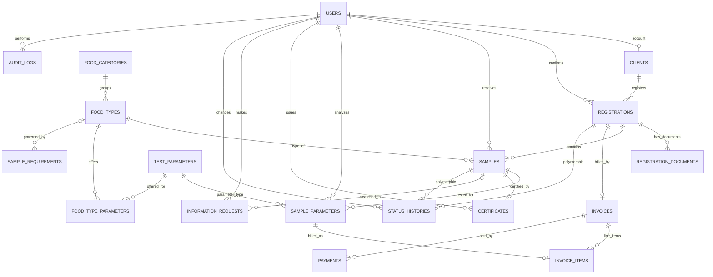
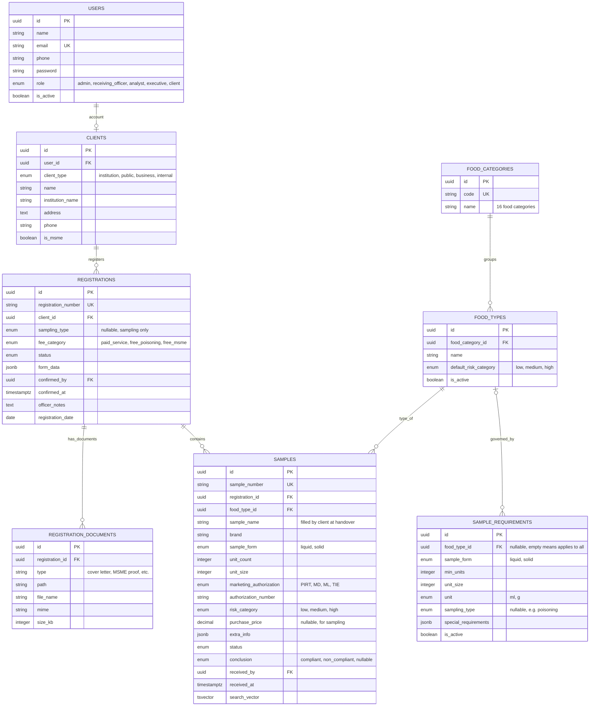
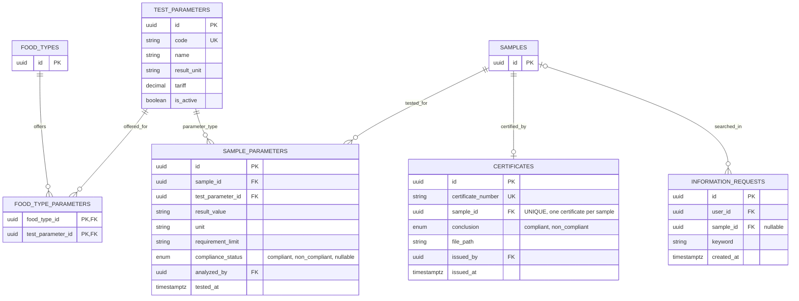
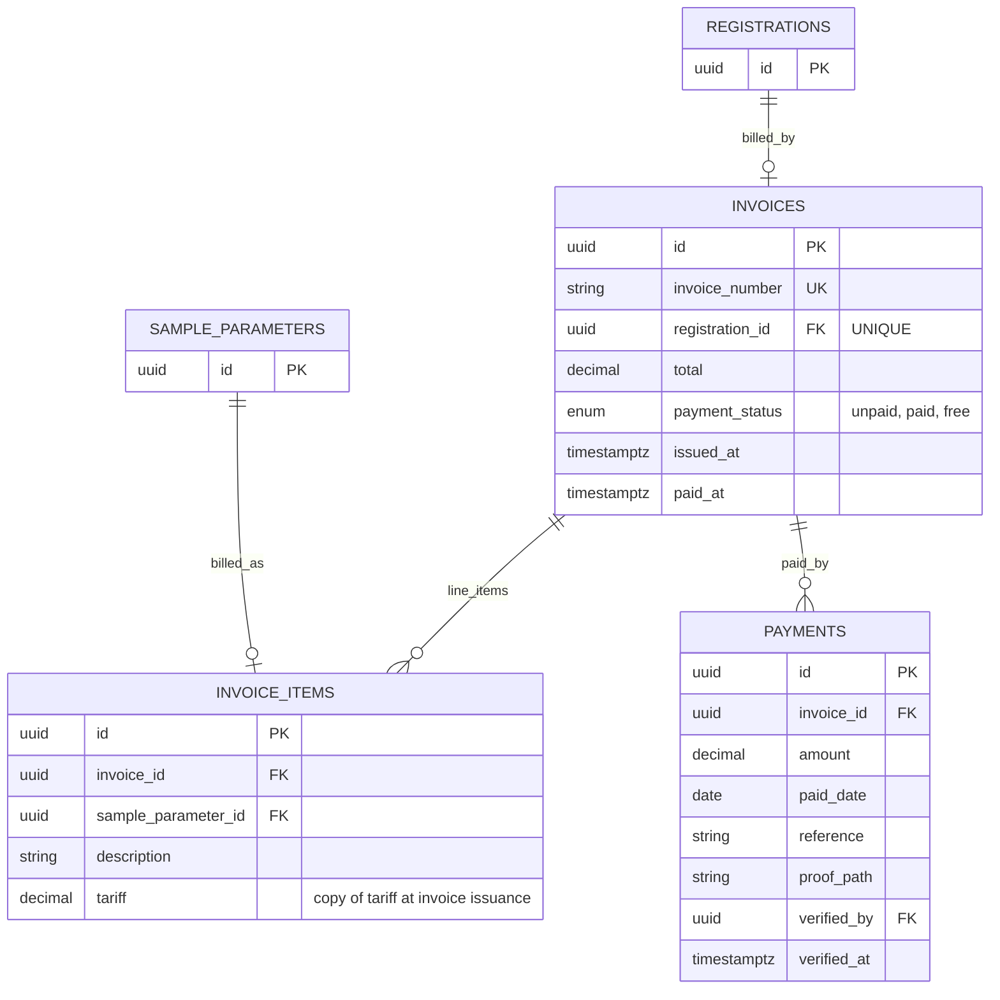
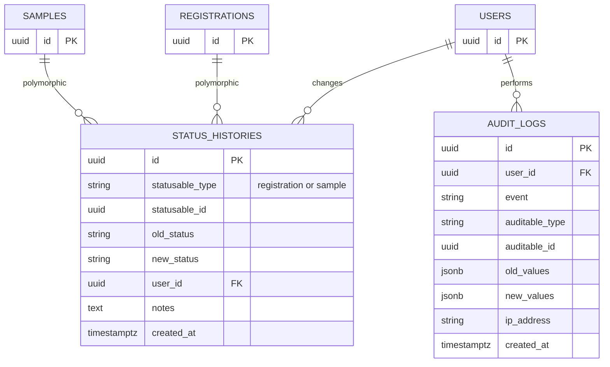

# Product Requirements Document (PRD)
## Sistem Informasi Layanan Pengujian dan Informasi Hasil Pengujian (SILAPAN)

| | |
|--|--|
| **Nama Sistem** | SILAPAN — Sistem Informasi Layanan Pengujian dan Informasi Hasil Pengujian |
| **Tanggal** | 23 September 2026 |
| **Penyusun** | Umar Saifudin — PFM Ahli Muda |
| **Instansi** | Balai Besar POM di Palangka Raya |

---

## Ringkasan Sistem

Balai Besar POM di Palangka Raya membutuhkan sistem digital terpadu untuk mengelola **layanan pengujian sampel pangan olahan dan informasi hasil pengujian**. Sistem ini memudahkan klien mendaftar dan membayar secara online serta memantau status dan hasil uji, membantu staf mengelola pendaftaran, sampel, dan hasil uji tanpa pencatatan manual, dan memberikan pimpinan dashboard serta laporan kapan saja. Target: memangkas waktu proses pendaftaran dari **3 hari** menjadi **10 menit** *(angka dari PRD awal, lihat Lampiran B)*.

---

## Arsitektur & Teknologi

### Stack Teknologi

| Komponen | Teknologi | Versi | Keterangan |
|----------|-----------|-------|------------|
| **Bahasa** | PHP | ≥ 8.3 | Versi minimum yang didukung Laravel 13 |
| **Framework** | [Laravel](https://laravel.com/) | v13 | Full-stack PHP framework |
| **Admin Panel** | [Filament](https://filamentphp.com/) | v5 | UI framework berbasis TALL Stack (Tailwind CSS, Alpine.js, Livewire, Laravel) |
| **Database** | PostgreSQL | ≥ 16 | RDBMS utama untuk seluruh data aplikasi |
| **Frontend** | TALL Stack | — | Tailwind CSS + Alpine.js + Livewire (bawaan Filament) |

### Arsitektur Database — PostgreSQL

| Fitur PostgreSQL | Kegunaan dalam SILAPAN |
|------------------|------------------------|
| **UUID** (`uuid` / `ulid`) | Primary key entitas publik (pendaftaran, sampel, invoice, sertifikat). Nomor yang mudah dibaca (`registration_number`, `sample_number`, `invoice_number`, `certificate_number`) disimpan di kolom unik terpisah |
| **JSONB** | Isian tambahan formulir dan informasi sampel (`form_data`, `extra_info`), serta syarat khusus per ketentuan sampel (`special_requirements`) |
| **Full-Text Search** (`tsvector`) | Pencarian sampel berdasarkan nama sampel dan nomor sampel (Layanan B) |
| **Enum Types** | Status pendaftaran, status sampel, kesimpulan MS/TMS, kategori tarif, izin edar (lihat Lampiran A.2) |
| **Partial Index** | Contoh: sampel yang sedang diproses (`WHERE status IN ('received','in_testing')`), invoice belum lunas |
| **Foreign Key Constraints** | Integritas antar tabel, termasuk satu sertifikat per sampel |
| **Timestamp with Time Zone** | Seluruh waktu disimpan `timestamptz`, ditampilkan `Asia/Jakarta` |

### Struktur Panel Filament v5

| Panel | Path | Peran Pengguna | Deskripsi |
|-------|------|----------------|-----------|
| **Admin** | `/admin` | Administrator, Petugas Penerima Sampel, Analis Laboratorium | Kelola seluruh data, pendaftaran, sampel, pembayaran, hasil uji, sertifikat, data master, dan pengguna |
| **Pimpinan** | `/pimpinan` | Pimpinan | Dashboard read-only, laporan, dan statistik |
| **Portal Klien** | `/portal` | Klien Eksternal, Klien Internal | Pendaftaran layanan, upload dokumen, cek status, unduh invoice, dan informasi hasil pengujian |

### Komponen Filament v5 yang Digunakan

| Komponen | Fungsi |
|----------|--------|
| **Resources** | CRUD: Pendaftaran, Sampel, Invoice, Sertifikat, data master (kategori pangan, jenis pangan, parameter uji, ketentuan sampel), Pengguna |
| **Relation Managers** | Sampel dalam Pendaftaran, Parameter dan Hasil Uji dalam Sampel, Pembayaran dalam Invoice, Dokumen dalam Pendaftaran |
| **Dashboard Widgets** | Stat dan chart widgets untuk Bagian 3 |
| **Actions & Modals** | Konfirmasi pendaftaran, verifikasi pembayaran, terima sampel, input hasil uji, terbitkan sertifikat |
| **Notifications** | Notifikasi in-app untuk klien (pendaftaran dikonfirmasi, invoice terbit, hasil selesai) dan petugas (pendaftaran baru, pembayaran masuk) |
| **Tables** | Filter periode, jenis pangan, status, asal pengirim; pencarian nomor sampel; bulk actions |
| **Forms** | Form pendaftaran dengan conditional fields (jenis sampling, gratis), validasi jumlah minimal sampel, upload dokumen |
| **Infolists** | Detail pendaftaran, sampel, dan hasil uji read-only |
| **Custom Pages** | Informasi Hasil Pengujian (Layanan B) di Portal Klien, halaman laporan dan ekspor |

---

## 1. Pengguna Sistem

| Peran | Siapa | Yang Mereka Lakukan | Panel Filament |
|-------|-------|---------------------|----------------|
| **Administrator** | Staf TI | Mengatur seluruh data dan hak akses pengguna | Admin |
| **Petugas Penerima Sampel** | Staf loket layanan | Input pendaftaran, konfirmasi, cetak invoice, verifikasi pembayaran, terima sampel | Admin |
| **Analis Laboratorium** | Analis/penguji *(usulan, belum ada di PRD awal)* | Mencatat hasil uji per parameter dan status pengujian | Admin |
| **Pimpinan** | Kepala Balai | Melihat dashboard dan laporan — hanya baca | Pimpinan |
| **Klien Eksternal** | Instansi lain, masyarakat, pelaku usaha | Daftar layanan, upload dokumen, bayar, cek status dan hasil | Portal Klien |
| **Klien Internal** | Tim sampling BBPOM | Mendaftarkan sampel hasil sampling, cek status dan hasil | Portal Klien |

---

## 2. Layanan yang Dikelola Sistem

### Layanan A — Pengujian

**Deskripsi:** Pengujian sampel pangan olahan bagi klien eksternal maupun internal (tim sampling). Klien memilih jenis pangan dan parameter uji, mendaftar, membayar (kecuali sampel gratis), menyerahkan sampel, lalu menerima sertifikat hasil uji.

**Alur:**
1. Klien memilih jenis pangan dan parameter uji yang tersedia
2. Klien mengisi formulir pendaftaran
3. Petugas mengecek dan mengonfirmasi pendaftaran
4. Sistem menerbitkan invoice; klien membayar (dilewati untuk sampel keracunan dan sampel UMKM gratis)
5. Klien mengisi informasi sampel dan menyerahkan sampel kepada petugas penerima sampel
6. Petugas memeriksa jumlah dan kelengkapan sampel, lalu menerima sampel *(usulan: langkah ini tersirat)*
7. Analis melakukan pengujian dan mencatat hasil uji per parameter beserta kesimpulan MS/TMS *(usulan: langkah ini tersirat)*
8. Sertifikat hasil uji diterbitkan

**Data yang dicatat:** nama pengirim · asal instansi · tipe pengirim (instansi, masyarakat, pelaku usaha, internal) · jenis sampling (targeted, pendampingan, kasus, keracunan) · jenis pangan · kategori pangan (16 kategori) · jenis izin edar (PIRT, MD, ML, TIE) · kategori risiko produk (rendah, sedang, tinggi) · parameter uji · jumlah dan bentuk sampel · harga pembelian sampel *(untuk sampling)* · status bayar · status pengujian · hasil uji dan kesimpulan (MS/TMS) · nomor sertifikat

*Catatan review: kolom jenis sampling, kategori pangan, izin edar, kategori risiko, MS/TMS, dan harga pembelian sampel tidak ada di daftar data PRD awal, tetapi dibutuhkan oleh dashboard di Bagian 3, sehingga ditambahkan di sini.*

**Aturan bisnis:**
- Sampel harus memenuhi **jumlah minimal** pengujian. Contoh dari PRD awal: produk cair 10 botol @500 ml, produk padat 10 bungkus @50 g. Sampel keracunan memiliki **syarat khusus** (lihat Lampiran B). Nilai disimpan di data master `sample_requirements`, bukan ditulis permanen di kode
- **Harus lunas** pada saat sampel diserahkan kepada petugas penerima sampel. Pengecualian: **sampel keracunan** dan **sampel UMKM** digratiskan (kategori tarif `free_poisoning` / `free_msme`)
- Pilihan parameter uji dibatasi pada parameter yang **tersedia untuk jenis pangan** yang dipilih *(usulan)*
- Setiap pendaftaran, sampel, invoice, dan sertifikat mendapat **nomor unik**
- Sertifikat hanya dapat diterbitkan setelah **seluruh parameter sampel memiliki hasil uji** dan status sampel `completed` *(usulan)*
- Tarif setiap parameter disalin ke invoice saat diterbitkan, sehingga perubahan tarif tidak mengubah invoice lama *(usulan)*
- Setiap perubahan status tercatat dalam riwayat (waktu, pengguna, catatan)
- Klien hanya dapat melihat pendaftaran dan sampel miliknya sendiri

---

### Layanan B — Informasi Hasil Pengujian

**Deskripsi:** Klien memeriksa status pengujian dan mengunduh sertifikat hasil uji melalui aplikasi, tanpa harus datang atau menghubungi petugas.

**Alur:**
1. Klien login ke Portal Klien dan membuka menu Informasi Hasil Pengujian
2. Klien mencari berdasarkan nomor sampel, nama sampel, atau nama pengirim sampel
3. Aplikasi secara otomatis memeriksa dan mengonfirmasi bahwa sampel tersebut dikirim oleh klien yang bersangkutan
4. Aplikasi menampilkan status pengujian
5. Jika status sudah selesai diuji, aplikasi menampilkan hasil dan menyediakan unduhan sertifikat hasil uji

**Data yang dicatat:** nama peminta informasi · asal instansi · jenis pangan dan parameter uji · status bayar · hasil uji · nomor sertifikat · waktu permintaan informasi

**Aturan bisnis:**
- **Hanya pengirim sampel** yang dapat memeriksa atau meminta informasi hasil pengujian atas sampel yang ia kirim
- Sertifikat hanya dapat diunduh jika status pengujian **selesai**
- Jika sampel yang dicari bukan milik peminta, sistem menampilkan "tidak ditemukan" tanpa mengungkap keberadaan sampel *(usulan)*
- Setiap permintaan informasi dicatat (peminta, sampel, waktu) *(usulan)*

---

## 3. Laporan & Dashboard yang Dibutuhkan

### Dashboard Utama (tampil saat login)

| Informasi | Keterangan |
|-----------|------------|
| Sampel diterima | Total sampel diterima per bulan atau per tahun |
| Anggaran pembelian sampel | Total anggaran pembelian sampel per bulan |
| Asal pengirim sampel | Sebaran instansi, pelaku usaha, masyarakat, dan internal |
| Jumlah dan jenis sampel | Sampel yang diterima dan diuji, per jenis pangan |
| Jumlah dan jenis parameter uji | Sebaran parameter yang diminta dan diuji |
| Jenis sampling | Targeted, pendampingan, kasus, keracunan |
| Jenis izin edar | PIRT, MD, ML, TIE |
| Kategori pangan | Sebaran menurut 16 kategori pangan |
| Kategori risiko produk | Rendah, sedang, tinggi |
| Status pengujian dan hasil uji | On process, selesai; dan MS/TMS |

### Laporan Berkala

| Laporan | Frekuensi | Isi | Format |
|---------|-----------|-----|--------|
| Rekap bulanan | Bulanan | Rekap sampel, parameter uji, dan hasil uji pada bulan berjalan | Excel & PDF |
| Statistik pengirim sampel | Bulanan dan triwulanan | Jumlah pengirim dan sampel menurut asal pengirim | Excel & PDF |

Semua dashboard dan laporan dapat difilter menurut periode (bulan, triwulan, tahun).

---

## Lampiran A — Rancangan Data (ER Diagram)

Seluruh nama tabel, kolom, relasi, dan nilai enum pada diagram memakai bahasa Inggris (konvensi Laravel: nama tabel jamak, `snake_case`). Istilah domain yang berupa singkatan resmi (PIRT, MD, ML, TIE) dipertahankan.

### A.1 Gambaran Umum Relasi

Diagram berikut menampilkan seluruh entitas dan relasinya tanpa kolom. Detail kolom ada di A.3 sampai A.6.

### A.2 Nilai Status (Enum) — Usulan

| Entitas | Nilai (berurutan) |
|---------|-------------------|
| **`registrations.status`** | `pending` → `confirmed` → `paid` (atau langsung siap untuk kategori gratis) → `completed`; cabang: `rejected`, `cancelled` |
| **`samples.status`** | `awaiting_sample` → `received` → `in_testing` → `completed`; cabang: `rejected` (tidak memenuhi syarat sampel). Dashboard "on process" = `received` + `in_testing` |
| **`samples.conclusion`** | `compliant` (MS, memenuhi syarat), `non_compliant` (TMS, tidak memenuhi syarat), kosong selama belum selesai |
| **`registrations.fee_category`** | `paid_service`, `free_poisoning`, `free_msme` |
| **`invoices.payment_status`** | `unpaid`, `paid`, `free` |
| **`clients.client_type`** | `institution`, `public`, `business`, `internal` |
| **`registrations.sampling_type`** | `targeted`, `assistance`, `case`, `poisoning` (kosong untuk pendaftaran non-sampling) |
| **`samples.marketing_authorization`** | `PIRT`, `MD`, `ML`, `TIE` |
| **`samples.risk_category`** | `low`, `medium`, `high` |
| **`users.role`** | `admin`, `receiving_officer`, `analyst`, `executive`, `client` |

### A.3 Klien, Pendaftaran, dan Sampel

### A.4 Parameter Uji, Hasil Uji, Sertifikat, dan Informasi Hasil (Layanan B)

### A.5 Invoice dan Pembayaran

### A.6 Riwayat Status dan Audit

---

## Lampiran B — Asumsi & Poin yang Perlu Dikonfirmasi

| # | Poin | Usulan sementara |
|---|------|------------------|
| 1 | Target "3 hari menjadi 10 menit" pada Ringkasan sama dengan contoh di template pelatihan | Konfirmasi angka kondisi saat ini dan target sebenarnya |
| 2 | Nama sistem berbeda-beda di PRD awal ("Layanan Pengujian dan Hasil Pengujian" vs "Pengujian dan Hasil Pengujian") | Dipakai "Layanan Pengujian dan Informasi Hasil Pengujian (SILAPAN)", sesuai nama Layanan A dan B |
| 3 | Siapa yang mencatat hasil uji dan siapa yang menyetujui/menerbitkan sertifikat | Ditambahkan peran Analis Laboratorium; persetujuan berjenjang sebelum terbit belum dimodelkan |
| 4 | Syarat khusus sampel keracunan | Disimpan sebagai `special_requirements` (JSONB) di master ketentuan sampel, isi diberikan BBPOM |
| 5 | Angka jumlah minimal sampel di PRD awal berbunyi "misal" | Dianggap contoh; nilai final per bentuk sampel dan jenis pangan diisi BBPOM |
| 6 | Mekanisme dan tarif pembayaran (verifikasi bukti bayar manual, kode billing, atau integrasi lain) | Tarif per parameter di master; pembayaran dicatat dan diverifikasi petugas |
| 7 | Cara menetapkan sampel UMKM gratis (dokumen bukti, verifikasi oleh siapa) | Klien menandai UMKM dan mengunggah bukti; petugas memverifikasi saat konfirmasi |
| 8 | Daftar 16 kategori pangan, jenis pangan, dan parameter uji per jenis pangan | Diisi Administrator sebagai data master |
| 9 | Anggaran pembelian sampel: siapa yang menginput dan apakah hanya untuk sampling internal | Kolom `purchase_price` di sampel, diisi untuk sampel hasil sampling |
| 10 | "Statistik peserta" di PRD awal tampaknya sisa template | Diartikan sebagai statistik pengirim sampel |
| 11 | Definisi "pengirim" untuk Layanan B: hanya akun yang mendaftar, atau semua akun dari instansi yang sama | Hanya akun yang mendaftarkan sampel |

---

> **Catatan untuk AI Coding Assistant:**
>
> **Stack & Arsitektur:**
> - Framework: **Laravel 13** dengan **Filament v5** (TALL Stack)
> - Database: **PostgreSQL ≥ 16** — gunakan migration Laravel dengan driver `pgsql`
> - Gunakan **UUID/ULID** sebagai primary key; nomor pendaftaran, sampel, invoice, dan sertifikat adalah kolom unik terpisah
> - Gunakan **JSONB** via Laravel `$casts` untuk `form_data`, `extra_info`, `special_requirements`, dan audit log
> - Gunakan **Enum type** PostgreSQL (atau string enum yang dicasting di Model) untuk status sesuai Lampiran A.2
>
> **Mapping PRD → Kode:**
> - Setiap **layanan** di Bagian 2 → 1 modul Filament Resource + set tabel migration (lihat ER diagram Lampiran A). Layanan A → Resource Pendaftaran/Sampel/Invoice/Sertifikat; Layanan B → Custom Page di Portal Klien (read-only) + tabel `information_requests`
> - Setiap **alur** → urutan status pada kolom `status` (enum), dijalankan lewat Action class; setiap perpindahan status menulis `status_histories`
> - Setiap **data yang dicatat** → kolom migration + `$fillable` di Eloquent Model
> - Setiap **aturan bisnis** → validasi di Form schema Filament + business logic di Model/Action class. Contoh: aksi "Terima Sampel" ditolak kecuali invoice `paid` atau `free`; jumlah minimal sampel divalidasi dari tabel `sample_requirements`; sertifikat hanya dapat dibuat jika semua `sample_parameters` sudah punya hasil
> - Setiap **peran pengguna** → panel Filament sesuai tabel Struktur Panel dengan middleware auth + policy authorization; klien hanya dapat melihat data miliknya (query scope pada `client_id`), termasuk di halaman Informasi Hasil Pengujian
> - Bagian 3 → `StatsOverviewWidget`, `ChartWidget` di dashboard Filament + ekspor PDF/Excel; sertifikat dihasilkan sebagai PDF
> - Perubahan data penting → `audit_logs`
> - Jangan membuat fitur di luar ruang lingkup PRD tanpa memastikan terlebih dahulu bahwa fitur itu diperlukan
>
> **Referensi:**
> - Dokumentasi Filament v5: https://filamentphp.com/docs
> - Dokumentasi Laravel: https://laravel.com/docs
> - Dokumentasi PostgreSQL: https://www.postgresql.org/docs/

---
